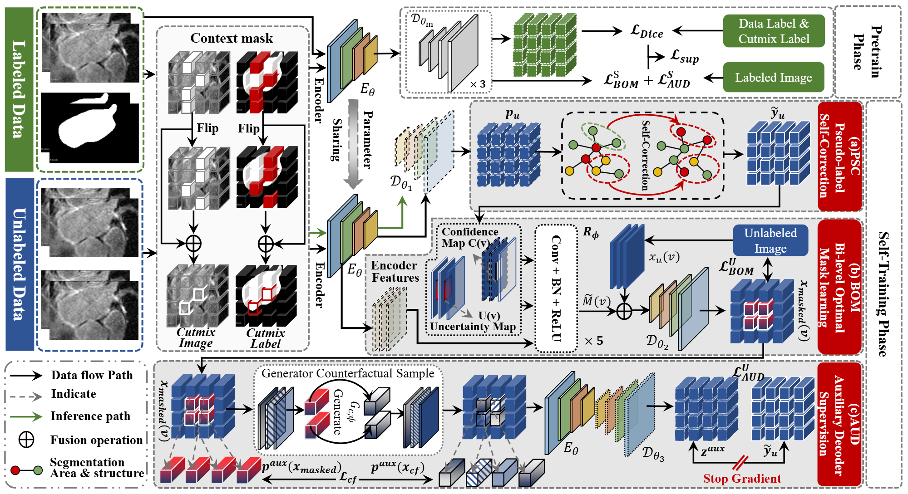

# PSCM: Pseudo-Label Self-Correction with Mask Learning for Semi-Supervised Medical Image Segmentation

  
  
  
  
  

## The code will be released later.

【Abstract】
Semi-supervised medical image segmentation has emerged as a promising approach for reducing the reliance on extensive manual annotations. However, existing methods still face two key challenges. First, pseudo-label learning is easily corrupted by structural errors, which can lead to inaccurate predictions being reinforced during consistency training. Second, mask learning often amplifies errors due to heuristic and structure-agnostic masking strategies. To address the above issues, we propose a unified framework for Pseudo-Label Self-Correction with Mask Learning (PSCM). PSCM integrates three complementary components to enhance pseudo-label reliability and strengthen representation learning under mask learning. First, the pseudo-label self-correction (PSC) module rectifies pseudo-labels by enforcing structural consistency between labeled and unlabeled samples. Furthermore, the bi-level optimal mask learning (BOM) strategy adaptively selects uncertain and boundary-sensitive regions for mask learning, thereby improving representation quality and enabling targeted error suppression. Additionally, the auxiliary decoder (AUD) enhances feature robustness by aligning model representations across factual and counterfactual environments, thereby effectively mitigating the impact of distributional shifts and improving generalization performance. Comprehensive experiments were conducted on five widely used 3D and 2D benchmark datasets, including MSD-Lung Tumor, NIH-Pancreas, Left Atrium, AMOS, and M&M. The results show that PSCM consistently delivers improved segmentation performance across different annotation ratios. 

## Main Figure

  

